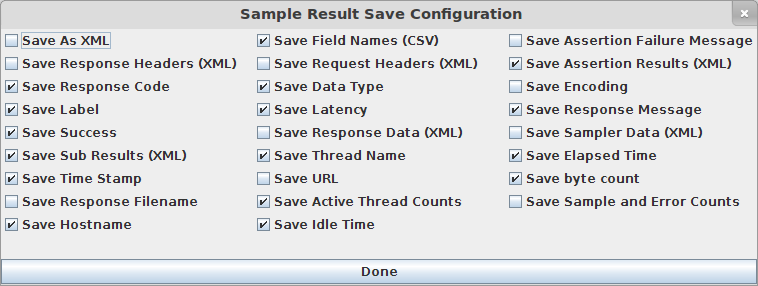

# Gee - a JMeter EC2/Remote host Runner
-----------------------------

This project is based on the Oliver Lloyd's [jmeter-ec2](https://github.com/oliverlloyd/jmeter-ec2) project.
I've added few extension and modifitcations, like:
* custom config files that are not commited to the repo
* generate reports automatically using [JMeterPluginsCMD](https://code.google.com/p/jmeter-plugins/wiki/JMeterPluginsCMD)
* generate reports manually from zipped result files using JMeterPluginsCMD
* start PerfMon server agent on load generatign nodes
* install jmeter-plugins
* simple integration with [Jenkins CI](http://jenkins-ci.org/)

If all pre-requisits are met, script will automatically download all required
tools and plugins.
Original script was modified in way that to make it as standalone as possible. 
This means that the section in the original project description about the 
pre-requisits and system variables is not valid anymore apart from the JAVA\_HOME


## Prerequisites
1. java 6+ with JAVA\_HOME sys variable set `required to locally generate graphs`
2. CLI tools: scp, wget, zip, unzip, grep `required to download: jmeter with plugins, ec2 tools, results from nodes`
3. an EC2 account, a key pair pem file along with AWS Access Key ID & Secret Access Key


To get your your:
* Key Pair pem file (it's a private key) go [here](https://console.aws.amazon.com/ec2/home?region=us-east-1#s=KeyPairs)
* Access Key ID & Secret Access Key go to the [Security Credentials](https://portal.aws.amazon.com/gp/aws/securityCredentials) page


Then:
* Save the pem file in the ./ec2 folder
* Change the pem file properties to 400, i.e. `chmod 400 ./ec2/thisipemfile.pem`
* Create a copy of the 'secrets.properties' file and prepend your user name to its name. (\*)
* Add your Access Key ID and Access Secret Key is that file


(\*) i.e.: if your user name is 'jk', then file should be named: jk\_secrets.properties
ps. By default all the \*\_secrets.properties files are ignored by git. 
To change this behaviour please edit .gitignore file.


## How to configure it
Edit the file jmeter-ec2.properties and follow instruction inside that file.

You can also create also a custom cfg file i.e. per specific environment and use
it by passing "cfg" parameter to the jmeter-ec2.sh. This can be handy when running
tests on local machines and non on EC2

```bash
    project="drKingShultz" cfg="your_custom_cfg_file.properties" ./jmeter-ec2.sh
```

## How to set up your jmeter (jmx) project
Please you start creating your own project, please refer to an example project 
called "drKingShultz" in projects folder.

In next few steps I'll try to explain how I configure my projects.

__Step 1:__
First of all I highly recommend using `Utlimate Thread Group` plugin as the thread manager.
This plugin gives you precise control over the generated traffic.


__Step 2:__
Once you've added such a thread to your project, then to produce all the nice graphs,
add four listeners to your project:
* two to the thread group
    * jp@gc LatenciesOverTime
    * Generate Summary Results
* and two outside of the thread group
    * 2 PerfMon Collector listeners (local & remote)

__Step 3:__
Having all listeners in place, the next step is to configure them.
* Generate Summary Results 
    * fortunately it doesn't require any configuration, but please leave its name unchanged :)
* jp@gc LatenciesOverTime
    * should write it's results down to a "~/result.jtl" file.
* 2 PerfMon Collector listeners (local & remote)
    * Remote one should write results in: ~/PerfMon-remote.jtl
    * and Local one should write down to: ~/PerfMon-local.jtl
* jp@gc LatenciesOverTime and PerfMon Collectors 
    * should be configured just like this:
    * 

btw. Listener's "Configure" button is here :


__Step 4:__
In `projects` directory create a folder with the same name as the project file.
Then create `jmx` folder in it and place your jmx there.
Here's an example project folder structure:

    ./jmeter-ec2
        |
        \projects
            |
            \drKingShultz
                |
                \jmx
                    |
                    \drKingShultz.jmx


### Why do we need those listeners:
__Generate Summary Results__ is used to show status updates while running your tests.  
__jp@gc Latencies Over Time__ result file is used to generate most of the graphs.  
__PerfMon Collector listeners__, will collect stat data from the:
* machines you're running your test against  
* and from the EC2 machines running your jmeter tests

To collect data from both sources we're using [server-agent](http://code.google.com/p/jmeter-plugins/wiki/PerfMonAgent).
Read the short manual how to run the server agent on the remote machines.


# How to run your project
At the moment this script works well on Linux OSes (tested on Linux Mint 13,14,15, Ubuntu 12.04). 
Moreover it can be easily scheduled for execution on CI system like Jenkins.

## How to run it locally
Once you have everything in place, simply run:

```bash
    project="drKingShultz" count="2" ./jmeter-ec2.sh
```

"count" stands for the number of EC2 instances to be launched

To get a bit more verbose output, enable DEBUG mode :
```bash
    DEBUG=true project="drKingShultz" count="2" ./jmeter-ec2.sh
```

## How to run it on Jenkins
Create a new job:

Mark 'This build is parameterized' as enabled.
Then:
* add 'File parameter' and set 'File location' to 'test/jmeter-ec2/ec2/jmeter-ec2.pem'
* add 'Password Parameter' named 'AWS\_ACCESS\_KEY' with no default value
* add 'Password Parameter' named 'AWS\_SECRET\_KEY' with no default value
* add 'String parameter' name 'JAVA\_HOME' with default value poitning at the JAVA dir on the Jenkins

in the "Build" section add "Execute shell" and paste the code below:
```bash
    # change permission for keys
    if [ -e test/jmeter-ec2/ec2/jmeter-ec2.pem ]; then
        chmod 600 test/jmeter-ec2/ec2/jmeter-ec2.pem
    fi;

    # run the tests
    cd test/jmeter-ec2
    project="drKingShultz" count="2" ./jmeter-ec2.sh
    cd ../..

    # remove the unnecessary pem file
    # will prevent errors when trying to overide pem file on a new build 
    if [ -e test/jmeter-ec2/ec2/jmeter-ec2.pem ]; then
        rm test/jmeter-ec2/ec2/jmeter-ec2.pem
    fi;
```

## How to run it with local linux boxes
To access boxes that will be used as load generators, you'll need to configure 
them to allow passwordless SSH access.
[Here's](http://www.debian-administration.org/articles/152) a nice article how this can be done on Debian based OSes.

Then create a copy of `example-local-config.properties` file and adjust it to your needs.
The most important thing to remember is to fill up the list of the hostnames with valid
IPs/Hostnames you're going to use as generators and a pem key filename, which is your private key, generated when configuring passwordless SSH access.

Then run the project providing the "cfg" parameter.

```bash
   project="drKingShultz" cfg="path/to/your/custom/config/file" ./jmeter-ec2.sh 
```

ps. You don't have to provide the "count" parameter, as it will be automatically set to number of hosts in the config file.


## Reports
Once test is finished, you can find a simple HTML report in the:

    jmeter-ec2
        |
        \drKingShultz
            |
            \results

Report file name will start with the Datetime when test was run: %Y-%m-%d_-_%H-%M-report.html 
* ie: 2013-06-13_-_09-56-report.html 


## How to generate graphs from long test runs

By default jmeter-ec2 script will generate graphs using 1920x1200px resolution.
In case you need to process result files from very long test runs, you can use
analyzeZippedResults.sh script for this purpose.

```bash
    FILES="path/to/a/folder/with/result/files/file_name_pattern_with_an_asterisk-*.zip" WIDTH=20000 HEIGHT=1080 ./analyzeZippedResults.sh
```

Where:
* FILES -  [MANDATORY] A path to zipped result files. User can use an asterisk to process multiple files (i.e.: from multiple nodes). Just like you'd use 'ls' command to list all the files you want to process.
* WIDTH -  [OPTIONAL] sets the width of the generated graphs, default is 1920
* HEIGHT - [OPTIONAL] sets the height of the generated graphs, defaul is 1200
* JMETER - [OPTIONAL] is the path to jmeter folder with JMeterPlugins
* TARGET - [OPTIONAL] parameter that defines where output report with graphs will be stored. If not provided then "./target" will be used
* DEBUG -  [OPTIONAL] parameter that enables more verbose output, use DEBUG=true


## Original description:
----------------------------

Is available @ [jmeter-ec2](https://github.com/oliverlloyd/jmeter-ec2) page.

